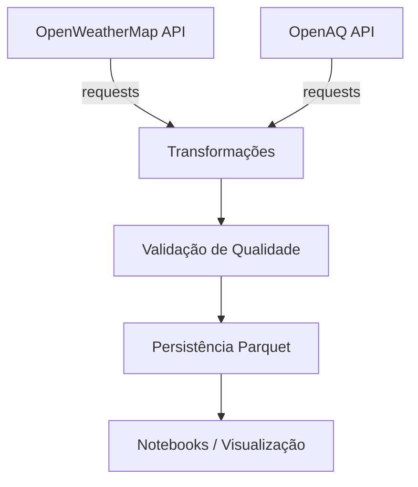

# 🌍 Projeto Pipeline de Dados — Clima & Qualidade do Ar

[](https://www.python.org/)
[](https://pandas.pydata.org/)
[]()

Este repositório contém um **pipeline de dados em Python** que integra informações climáticas do **OpenWeatherMap** e de qualidade do ar do **OpenAQ**.  
O fluxo segue as etapas de **extração → transformação → qualidade de dados → carga (ETL)** e persiste os dados em formato **CSV**.

---

## 🏗 Arquitetura



---

## ⚙️ Instalação

Clone o repositório:

```bash
git clone https://github.com/eduardohnsantos/Projeto-Pipeline-Python-Dados-API.git
cd Projeto-Pipeline-Python-Dados-API
```

Crie um ambiente virtual (opcional, mas recomendado):

```bash
python -m venv venv
source venv/bin/activate   # Linux/Mac
venv\Scripts\activate      # Windows
```

Instale as dependências:

```bash
pip install -r requirements.txt
```

---

## 🔐 Configuração

O projeto exige duas **chaves de API**:

- [OpenWeatherMap](https://openweathermap.org/api) → variável `OPENWEATHER_KEY`
- [OpenAQ v3](https://docs.openaq.org/) → variável `OPENAQ_KEY`

Crie um arquivo `.env` na raiz do projeto:

```dotenv
OPENWEATHER_KEY=sua_chave_openweather
OPENAQ_KEY=sua_chave_openaq
```

Você pode usar o `.env.example` como modelo:

```bash
cp .env.example .env
```

---

## ▶️ Execução

Rodar o pipeline completo para uma cidade:

```bash
python run_pipeline.py --city "Ribeirao Preto" --country "BR"
```

Ou utilizando o script shell:

```bash
bash run.sh "Ribeirao Preto" "BR"
```

Rodar apenas a extração de uma API:

```bash
python src/extract_openweather.py
python src/extract_openaq.py
```

---

## 🔄 ETL em detalhes

- **Extração**  
  - `extract_openweather.py` → clima (temperatura, umidade, pressão, vento, descrição)  
  - `extract_openaq.py` → qualidade do ar (PM2.5, PM10, O₃, CO etc.)  

- **Transformação**  
  - Padronização de colunas  
  - Conversão de timestamps → UTC  
  - Pivot dos parâmetros de poluentes → colunas wide  
  - Junção clima + ar por cidade e tempo mais próximo  
  - Criação de colunas derivadas (`feels_like_gap`, categoria de qualidade do ar)  

- **Qualidade de Dados**  
  - Contagem de linhas  
  - Proporção de nulos por coluna  
  - Range check (temperatura, umidade, pressão, poluentes)  
  - Geração de relatório `dq_report.json`  

- **Carga**  
  - Persistência em **Parquet particionado** (`year=` / `month=`)  
  - Histórico mantido em múltiplos arquivos (`part-*.parquet`)  

---

## ✅ Qualidade de Dados

Exemplo de relatório gerado (`dq_report/dq_report.json`):

```json
{
  "row_count": 1,
  "null_ratio": {
    "temperature": 0.0,
    "humidity": 0.0,
    "air_PM25": 0.0
  },
  "range_checks": {
    "temperature": true,
    "humidity": true,
    "air_PM25": true
  }
}
```

---

## 📦 Saídas

- Dados finais: `output/final_dataset/year=YYYY/month=MM/part-*.parquet`  
- Relatório de qualidade: `dq_report/dq_report.json`  
- Notebook exploratório: `notebooks/exploration.ipynb`  

---

## 📁 Estrutura de Pastas

```
Projeto-Pipeline-Python-Dados-API/
├── README.md
├── requirements.txt
├── .env.example
├── run.sh
├── run_pipeline.py
├── src/
│   ├── extract_openweather.py
│   ├── extract_openaq.py
│   ├── transform.py
│   ├── dq_check.py
│   └── load.py
├── tests/
│   └── test_transform.py
├── notebooks/
│   └── exploration.ipynb
├── output/
│   └── final_dataset/
└── dq_report/
    └── dq_report.json
```

---

## 🚀 Possíveis Melhorias

- Salvar em PostgreSQL ou Data Warehouse  
- Agendamento com Airflow ou GitHub Actions  
- Suporte a múltiplas cidades em lote  
- Dashboards em **Streamlit** ou **Power BI**  
- Mais testes unitários e integração contínua  

---

## 📜 Licença

Este projeto é de uso educacional e pode ser adaptado livremente.  
Desenvolvido por **Eduardo Henrique** 🚀
